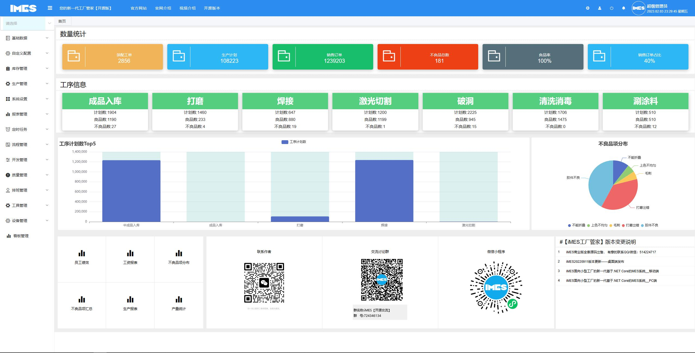
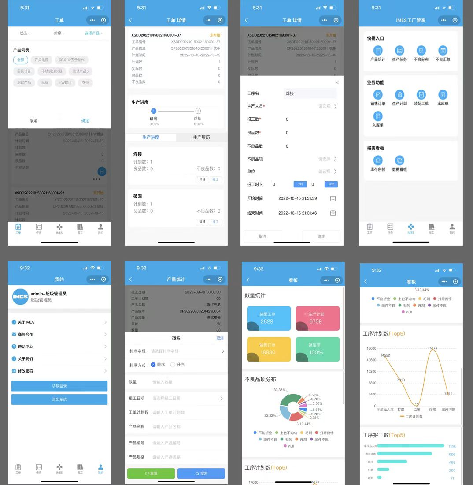
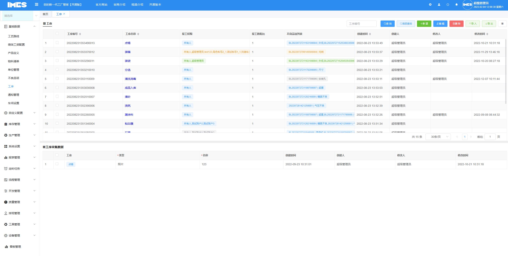
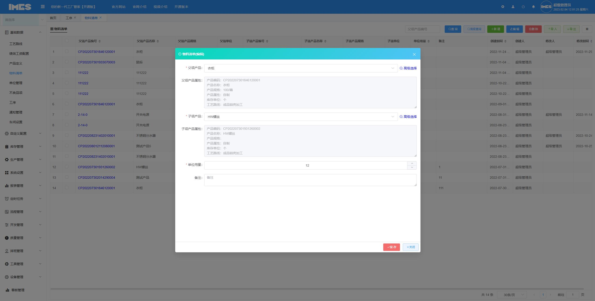
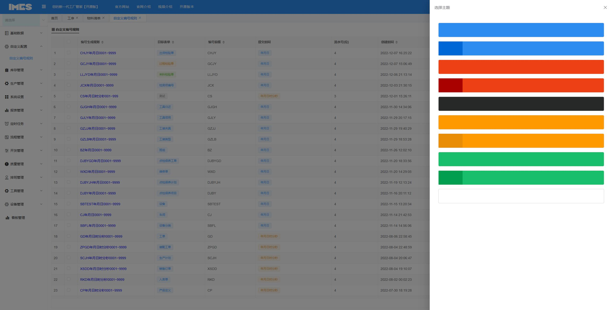
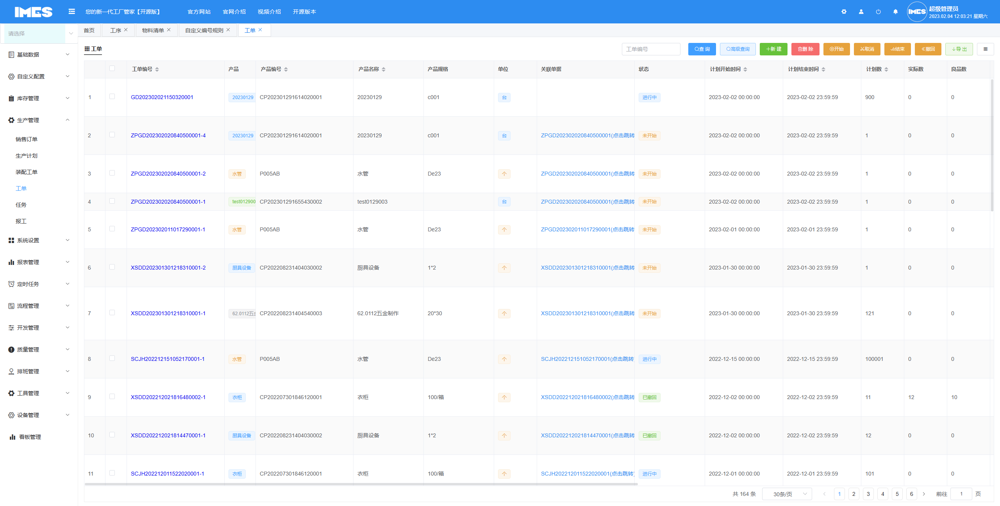
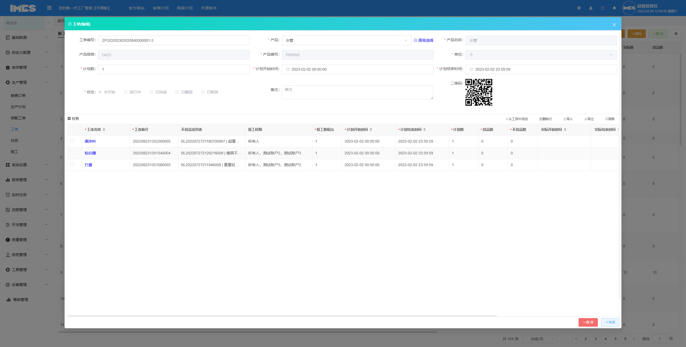
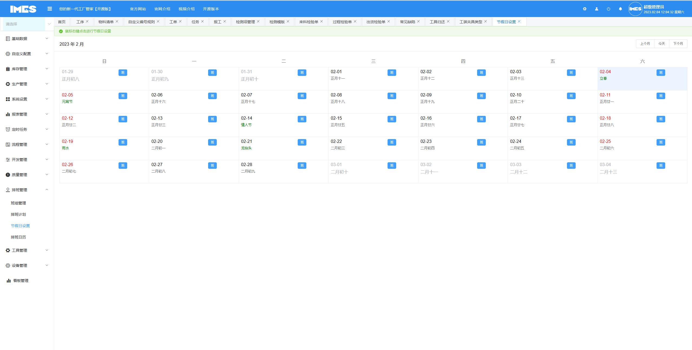
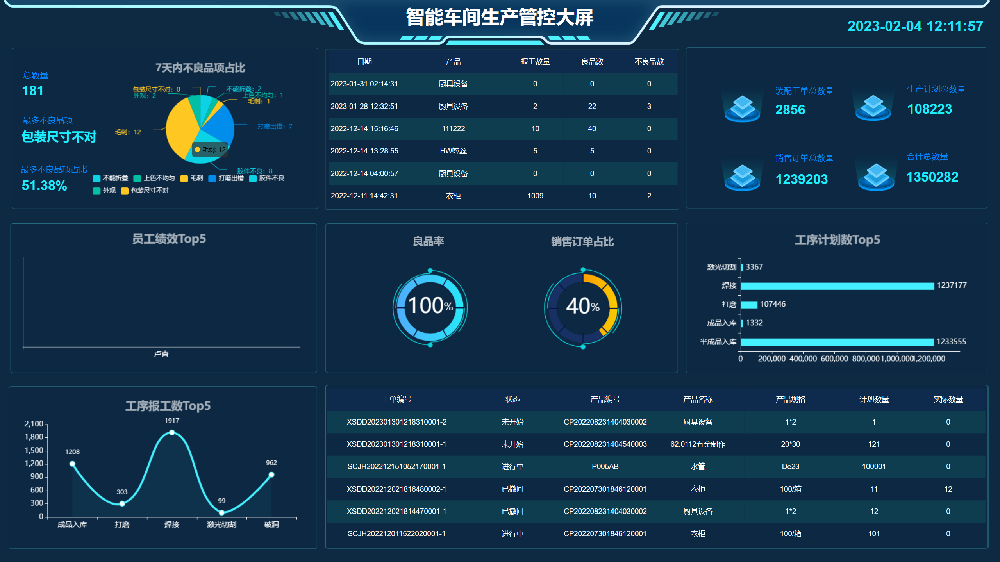

## iMES工厂管家——您的新一代工厂助手

## 功能模块
 - 基础数据【工艺路线，绩效工资配置，产品定义，物料清单，单位管理，不良品项，工序，通知管理，车间设置】
 - 自定义配置【自定义编号规则】
 - 库存管理【出库单，入库单，库存收发明细，库存余额】
 - 生产管理【销售订单，生产计划，装配工单，工单，任务，报工】
 - 系统管理【用户管理，部门管理，消息推送，权限管理，角色管理，菜单设置，数据字典，系统日志，角色管理（tree），版本发布记录，用户管理（tree）】
 - 报表管理【员工绩效，工资报表，不良品项分部，不良品项汇总，生产报表，产量统计】
 - 定时任务【任务配置，执行记录】
 - 流程管理【审批流程，我的任务】
 - 开发管理【表单设计，表单配置，数据采集，代码生成】
 - 质量管理【常见缺陷，检测项管理，检测模版，来料检验单，过程检验单，出货检验单】
 - 排班管理【班组管理，排班计划，节假日设置，排班日历】
 - 工具管理【工具领用，工具归还，工装夹具类型，工装夹具台账】
 - 设备管理【设备类型设置，设备台账，点检保养项目，点检保养计划，维修单，点检保养工单】
 - 看板管理【车间生产管控看板，工单执行进度看板】

## 框架预览
 - 框架内置了大量的通用组件可直接使用,并内置了基于本框架定制开发的代码生成器，尽量避免重复性代码编写。
 - 框架不仅仅是快速开发，更多的是倾向于业务代码扩展的编写与代码规范。
 - 如果有什么问题或建议，提issue或加QQ：514224717
 - QQ群：724346134
 - 商业版演示地址：http://imes.625sc.com
 - 开源版演示地址：http://imesopen.625sc.com
 - 帐号：admin密码：123456
 - gitee码云：https://gitee.com/ZM-Rid/i-mes-factory-housekeeper

## 框架核心
 - iMES工厂管家产品基于优秀的[Vue.NetCore](https://gitee.com/x_discoverer/Vue.NetCore)开发
 - 快速开发(基础功能全部由代码生成器生成)
 - 支持前端、后台自定义业务代码扩展,后台提供了大量常用扩展与通用类
 - 前端、后台提供了近300个扩展方法与属性,开发人员可在此功能上编写扩展自定义业务代码
 - 代码生成(代码生成器可直接生成主/从表前后端业务代码,有30多种属性可在线配置生成的代码)
 - 前端table自动转换key/value
 - 前端表单select/checkbox自动绑定数据源,不需要写任何代码
 - 支持(主从表)一对一前后端代码全自动生成、并支持数据源自动绑定与业务代码扩展,不需要写任何代码
 - 支持一对多从表自定义扩展(不限从表类型与从表数量) , 一对多从表使用扩展可轻松实现
 - 如果能上手框架，可以体会到不用996,更不用掉头发的感觉^_^

## 框架开发依赖环境
 - 后台：VS2019、vs2022 、.NetCore3.1 、EFCore3.1、JWT、Dapper、SignalR、Quartz.Net、Autofac、SqlServer2016、Redis
 - 前端：VsCode、vue3（需要安装nodejs)、vuex、axios、promise、element ui、element plus

## 开源版和商业版区别
 - 商业版提供【生产管理】模块
 - 商业版支持自定义实体扩展
 - 商业版支持打印模版设计
 - 商业版支持模版打印
 - 商业版支持Excel模版导出
 - 商业版拥有移动端，可以一套代码导出H5,Android,iOS端。并且提供桌面端
 - 商业版提供可视化看板设计功能
 - 商业版提供技术支持，开源版只有开源交流QQ群

## 图片预览

## 项目启动与上手
- 运行前先看后台appsettings.json配置属性说明；(注意修改DbType属性，修改为自己使用的数据库,数据库脚本在DB文件夹下)
- 1、启动后台项目：后端项目路径  ../iMES.WebApi，找到dev_run.bat命令点击启动。后台启动 默认端口是9991。
(dev_run.bat如果闪退，请使用cmd切换至 ../iMES.WebApi目录下执行dotnet run看异常信息)
如从没执行过npm install命令，使用cmd命令切换至前端Vue项目../iMES.Vue路径下,执行npm install命令
- 2、启动前端项目：前端Vue项目路径 ../iMES.Vue ，  找到 run.bat命令点击启动 。
-  （1）(run.bat如果闪退,说明环境没配置好，请使用cmd切换至 ../iMES.Vue目录下执行npm run dev看异常信息)
-  （2）使用cmd命令切换到../iMES.Vue目录下执行npm cache clear --force或者安装node.js版本14.15.1
-  （3）输入http://localhost:8080访问（本地超级管理员帐号：admin 密码:123456）
- 详细文档查看：http://v2.volcore.xyz/document/guide

 
